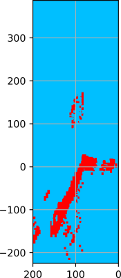
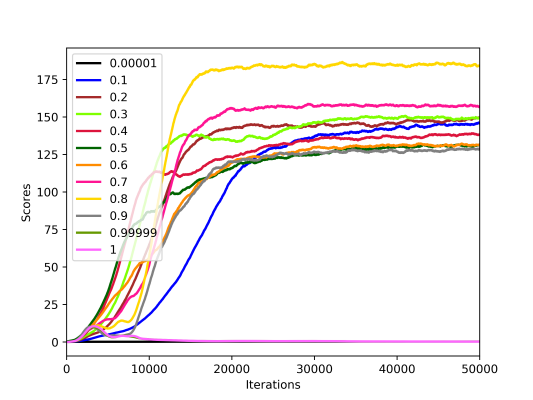

# Flappy Bird Bots (AI)

Based on [FlapPyBird](https://github.com/sourabhv/FlapPyBird) and [flappybird-qlearning-bot](https://github.com/chncyhn/flappybird-qlearning-bot).

## Dependencies

To run the game you need the following packages to install:

* python2.7
* python-tk

And in Python, you need to install the following libraries:

* numpy
* pygame
* sklearn
* matplotlib
* tensorflow ([guide to install](https://www.tensorflow.org/install/install_sources))

To install the libraries you can use, for example, the `python-pip` package and run the following commands:

    pip install numpy pygame sklearn matplotlib tensorflow

The codes have been tested on Ubuntu 16.04 and 18.04.

## Running The Game

To run the game with graphics interface (if not set `SHOW_SCREEN=False` in `constants.py`), run:

	python -B flappy.py

To run the game without graphics interface, run:

	python -B onlylearning.py

## Directory Structure

The following subsections describe contents of files and subdirectories.

### Files

#### The `bot.py` file

The file `bot.py` contains importing of all the bots available in the sources (the directory `bots`). In variable `BOT` loads the imported class you want to use.

#### The `constants.py` file

The file `constants.py` contains constants to run the game Flappy Bird. Meaning of the constants is as follows:

* `SPEED` represents frame rate in the game. 30 is the default value and the higher value is, the faster is the game. By using 0, the game is as fast as possible.
* `PLAY_SOUNDS` to play sounds of the game.
* `SHOW_SCREEN` to show the screen of the game.
* `FREEZ_AT_THE_END` to wait for the player to press a key after the death of the bird to start a new game.

#### The `flappy.py` file

The file `flappy.py` contains the sources of the game with the graphical interface. You can change the variable `USE_OWN_PIPES` to `True` if you want to use your own pipes and defined the folder where the pipes are saved in the `PIPES_FOLDER` variable. In the variable `NUMBER_OF_GAMES` you can specify how many games should be played. After that number is reached the game is terminated. You can also set the variable to a special value `INFINITE_GAMES` which means that the game is only terminated by the user (by closing the window or pressing `CTRL+c`).

#### The `onlylearning.py` file

The file `flappy.py` contains the sources of the game without the graphical interface. This file is usually used when a bot is trained (to train faster). Meanings of the variables `USE_OWN_PIPES`, `PIPES_FOLDER` and `NUMBER_OF_GAMES` are the same as it is in the previous subsection.

#### The `plotfigure.py` file

The file `plotfigure.py` contains three functions which are prepared to be run by the `runp` program (installation, ex. `pip install runp`).

* `plot_figure` visualizes the input data of scores to an output image with trend accuracy set in the variable `TREND_ACCURACY`.
* `plot_scores_with_average` visualizes the input scores to an output image with the highlighted average score.
* `plot_scores_with_average` visualizes individual games with the highlighted average score of the input score files from the variable `FILES`.

#### The `run.sh` file

The file `run.sh` is a bash script which runs multiple instances of the `onlylearning.py` script with tags defined in the file in the part `seq x y` where `x` is the beginning tag and `y` is the ending tag (for example for `seq 1 3` the script will run three instances `python -B onlylearning.py 1 &`, `python -B onlylearning.py 2 &` and `python -B onlylearning.py 3 &`).

### Directories

#### The `assets` directory

The directory `assets` contains files for the game itself (audio, sprites, other static data, etc.).

#### The `bots` directory

The directory `bots` contains an abstract class `Bot` in the file `bot.py`. The class contains three methods `act`, `dead` and `stop`. All of these methods should be implemented to define a new bot.

The already implemented bots:

* A **greedy bot** in the file `bot_greedy.py`.
* Another **greedy bot** in the file `bot_greedy_2.py`.
* A bot implementing the **Q-learning** algorithm with parameters:
    * `LEARNING` defining whether the bot should be trained or not,
    * `VERTICAL_ACCURACY_OF_STATES` representing the rounding number for the vertical positions,
    * `HORIZONTAL_ACCURACY_OF_STATES` representing the rounding number for the horizontal positions,
    * `ALIVE_REWARD` and `DEAD_PENALIZATION` representing the positive and negative rewards in the game,
    * `Q_FILE_BASE` representing the base for the name of the file where Q-values are stored,
    * `DATA_FILE_BASE` representing the base for the name of the file where scores of the played games are stored,
    * `DISCOUNT` representing the parameter discount factor of the Q-learning algorithm,
    * `LEARNING_RATE` representing the parameter learning rate of the Q-learning algorithm,
    * `EPSILON_POLICY` defining whether ϵ-greedy policy is used or not,
    * `DUMPING_RATE` representing the number after how many iterations the Q-values in the file should be updated,
    * `LAST_STATES_PENALIZED` representing the number of the last states to be penalized,
    * `STEPS` representing the number of future steps taken into account when picking a new action.
* A bot implementing the **Deep Q-learning** algorithm with parameters:
    * `LEARNING` defining whether the bot should be trained or not,
    * `REWARD` and `PENALIZATION` representing positive and negative rewards in the game,
    * `DATA_FILE` representing the name of the file where scores of the played games are stored,
    * `EPSILON_POLICY` defining whether ϵ-greedy policy is used or not,
    * `DUMPING_RATE` representing the number after how many iterations the Q-network is updated in the file,
    * `LAST_STATES_IGNORED` representing the number of the last states which are ignored during training the Q-network,
    * `STEPS` representing the number of future steps taken into account when picking a new action,
    * `REPLAY_MEMORY_CAPACITY` representing the capacity of the replay memory,
    * `MINIBATCH_SIZE` representing the size of the mini-batch used for training the Q-network,
    * `REPLAY_STEPS` representing the number of repetitions for training the Q-network with the initial data,
    * `TRAIN_STEP` representing the number of repetitions for training the Q-network with the all other data collected during training,
    * `PROBABILITY_TO_FLAP` representing the probability to flap when taking a random action,
    * `GREEDY_PROBABILITY` representing the probability of taking a greedy action during initialization,
    * `NETWORKS_COUNT` representing the number of trained networks when using more Q-networks.

#### The `models` directory

The directory `models` contains two folders:

* `DeepQLearning` containing a pre-trained model for the Deep Q-learning algorithm,
* `QLearning` containing a pre-trained model for the Q-learning algorithm.

#### The `scripts` directory

The directory `scripts` contains four files:

The file `heatmap_q_values.py` contains a script to create the heatmap of decisions of a bot. To run the script first load the bot, you want to use, in the `bot` variable. Then set the velocity you want to visualize in the variable `VEL` and set the name of the output file in the variable `OUT_IMAGE` and other parameters respectively. Run the script by:

    python heatmap_q_values.py

To crop the images use one of the following commands:

    convert -crop 854x1954+1106+285 name.png

or

    mogrify -crop 854x1954+1106+285 *.png

where `X=1106`, `Y=285`, `Width=854` and `Height=1954`.

An example output from the file [scripts/ql10.png](scripts/ql10.png):

The file `init_train_functions.py` contains functions to generate and compare initial Q-networks by using Q-values generated by the Q-learning algorithm. The meaning of the significant constants:

* `NETWORKS_COUNT` represents the number of Q-networks to generate.
* `OPTIMIZERS` represents used optimizers for Q-networks (*i*th network will use (*i* mod `len(OPTIMIZERS)`)th optimizer).

The meaning of the public functions is as follows:

* `get_q_values` returns Q-values stored in the file with name `file_name`,
* `positive_and_negative_values` prints the number of positive and negative values of the given Q-values,
* `max_min_value` prints the max and min Q-value,
* `get_data_for_training` returns data in a format for learning,
* `save_decisions` enriches the Q-values with the actions which are taken by Q-learning for each state,
* `train_networks` trains the input `networks` with `data_in` and `data_out` `train_count` times,
* `compare_computation` compares decisions of Q-values and Q-networks.

An example of using the defined functions could be as follows:

    from init_train_functions import *
    q = get_q_values("q")
    inn, outt = get_data_for_training(q)
    count = len(inn)
    networks = [FNN(OPTIMIZERS[i % len(OPTIMIZERS)], i) for i in range(NETWORKS_COUNT)]
    networks = train_networks(networks, inn[:count], outt[:count], 100)
    compare_computation(networks, q, 100)

The file `pipes_generator.py` generates pipes for the Flappy Bird game (for example to use the same situations when comparing the performance of algorithms). The parameter `PIPES_IN_ONE_GAME` defines how many pipes are in one generated game, `NUMBER_OF_GAMES` defines the count of generated games and `FOLDER` represents the folder where the generated games are stored.

The file `plot_multiple_data.py` plots multiple scores stored in files for individual instances in folders defined in the `files` variable. `TESTS_COUNT` defines how many scores in each folder should be taken into account. `FOLDER_BASE` defines the root folder where subfolders with the data are stored. The `indices` variable defines strings for the legend - *i*th string is used for the *i*th file in `files`. The output image is stored in `FOLDER_BASE` + `TYPE` + ".png" file and the highest score and highest average score and the highest score and the highest average score of the worse instance are stored in the file `FOLDER_BASE` + `TYPE` + ".txt".

An example output from the file [scripts/lr.png](scripts/lr.png):

